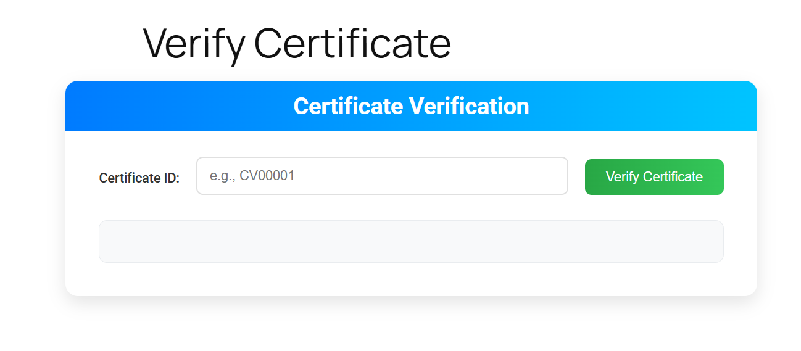

# Certificate Verification WordPress Plugin

## Description
The Certificate Verification plugin allows users to verify student certificates using a shortcode on the front end, while providing administrators with tools to manage certificates and course links in the WordPress admin area. It supports certificate verification via a custom URL structure (`/verify/{certificate_id}`), social sharing (Facebook, LinkedIn, Copy Link), and detailed certificate management with validation and success messages.

### Features
- **Front-End Certificate Verification**: Use the `[cv_certificate_verifier]` shortcode to verify certificates by ID.
- **Custom Verification URLs**: Verify certificates via `/verify/{certificate_id}` with redirect to a verification result page.
- **Social Sharing**: Share verified certificates on Facebook, LinkedIn, or copy the verification link.
- **Admin Certificate Management**: Add, edit, delete, and bulk delete student certificates.
- **Course Links Management**: Add, edit, and delete course links associated with certificates.
- **Validation**: Ensures unique certificate IDs and student-father name combinations.
- **Success Messages**: Displays confirmation messages for all actions (e.g., "Certificate added successfully").
- **Debug Logging**: Logs actions and errors to `wp-content/cv-debug.log` for troubleshooting.

## Installation
1. **Download the Plugin**:
   - Clone this repository or download the ZIP file.
   ```
   git clone https://github.com/rumenhusen/certificate-verification.git
   ```
2. **Upload to WordPress**:
   - Copy the `certificate-verification` folder to the `wp-content/plugins/` directory of your WordPress installation.
3. **Activate the Plugin**:
   - In the WordPress admin panel, go to **Plugins > Installed Plugins**.
   - Find "Certificate Verification" and click **Activate**.
4. **Verify Setup**:
   - Upon activation, the plugin will create two database tables: `wp_cv_student_certificates` and `wp_cv_course_links`.
   - A page named "Certificate Verified" (slug: `certificate-verified`) will be created for verification results.
   - Check `wp-content/cv-debug.log` for initialization logs.

## Usage
### Front-End Verification
1. **Add the Shortcode**:
   - Create or edit a page/post in WordPress.
   - Add the shortcode `[cv_certificate_verifier]`.
   - Users can enter a certificate ID (e.g., `CV00001`) and verify it.
2. **Verification Results**:
   - If the certificate is valid, details (e.g., student name, course name, issue date) will be displayed.
   - Share buttons (Facebook, LinkedIn, Copy Link) will appear for sharing the verification URL.
3. **Verification via URL**:
   - Access `/verify/{certificate_id}` (e.g., `/verify/CV00001`) to redirect to the verification result page.

### Admin Management
1. **Access the Plugin**:
   - After activation, a new menu item "Certificates" will appear in the WordPress admin sidebar.
2. **Manage Course Links**:
   - Go to **Certificates > Manage Course Links** to add, edit, or delete course links.
   - Course links are required to associate with student certificates.
3. **Manage Student Certificates**:
   - Go to **Certificates > Student Certificates** to add, edit, delete, or bulk delete certificates.
   - Use the "Certificate ID Settings" page to configure automatic or manual certificate ID generation.
4. **Success Messages**:
   - After performing actions (e.g., adding or deleting a certificate), you’ll see a success message (e.g., "Certificate added successfully").

## Debugging
- The plugin logs all actions and errors to `wp-content/cv-debug.log`.
- If you encounter issues, check the debug log for details on database operations, validation failures, or redirect issues.

## Requirements
- WordPress 5.0 or higher
- PHP 7.4 or higher
- jQuery (included with WordPress)

## License
This plugin is licensed under the [GPL-2.0+ License](LICENSE).

## Contributing
Contributions are welcome! Please submit a pull request or open an issue to report bugs or suggest features.

## Author
- **Md Rumen Husen** - [GitHub Profile](https://github.com/rumenhusen)

## Screenshots
Below are screenshots showcasing the plugin’s features. These images are hosted in the repository’s release assets.

1. **Front-End Certificate Verification Form**  
   The verification form where users enter a certificate ID.  
   

2. **Verification Result with Sharing Options**  
   The result displayed after verifying a certificate, including share buttons.  
   

3. **Admin Certificate Management Page**  
   The admin page for managing student certificates.  
   

4. **Admin Course Links Management Page**  
   The admin page for managing course links.  
   

5. **Certificate ID Settings Page**  
   The admin page for configuring certificate ID generation.  
   
